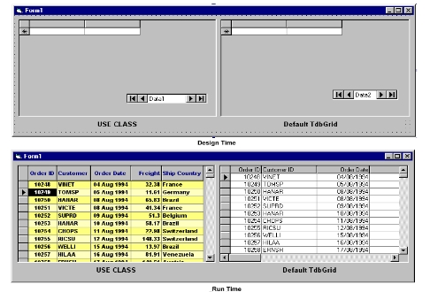



## True Dbgrid Class

### Description

How do you design your tdbgrid? For I know, designing grid takes a lot of time.

So how is if it can be done in run-time, and stay permanently? leave grid as default in design and let users to change style as they like.
 
### More Info
 

             |
---                |---
**Submitted On**   |2000-12-15 22:30:56
**By**             |[Januar Kwee](https://github.com/Planet-Source-Code/PSCIndex/blob/master/ByAuthor/januar-kwee.md)
**Level**          |Intermediate
**User Rating**    |4.4 (22 globes from 5 users)
**Compatibility**  |VB 6\.0
**Category**       |[Miscellaneous](https://github.com/Planet-Source-Code/PSCIndex/blob/master/ByCategory/miscellaneous__1-1.md)
**World**          |[Visual Basic](https://github.com/Planet-Source-Code/PSCIndex/blob/master/ByWorld/visual-basic.md)
**Archive File**   |[CODE\_UPLOAD1271412152000\.zip](https://github.com/Planet-Source-Code/januar-kwee-true-dbgrid-class__1-13610/archive/master.zip)

